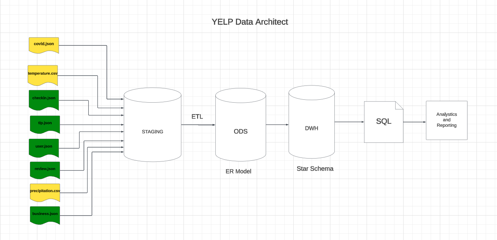
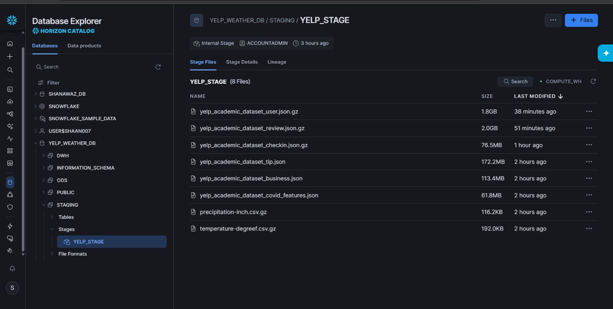
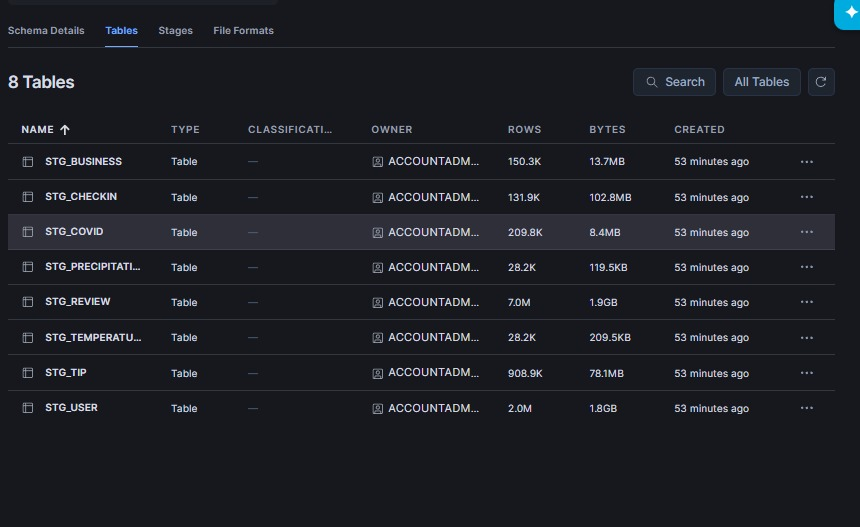
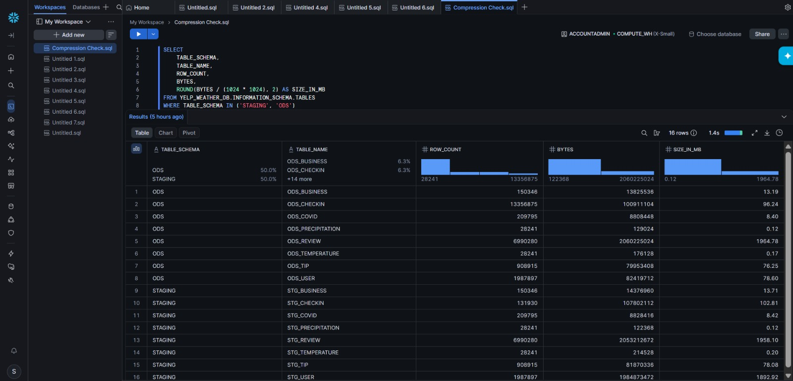
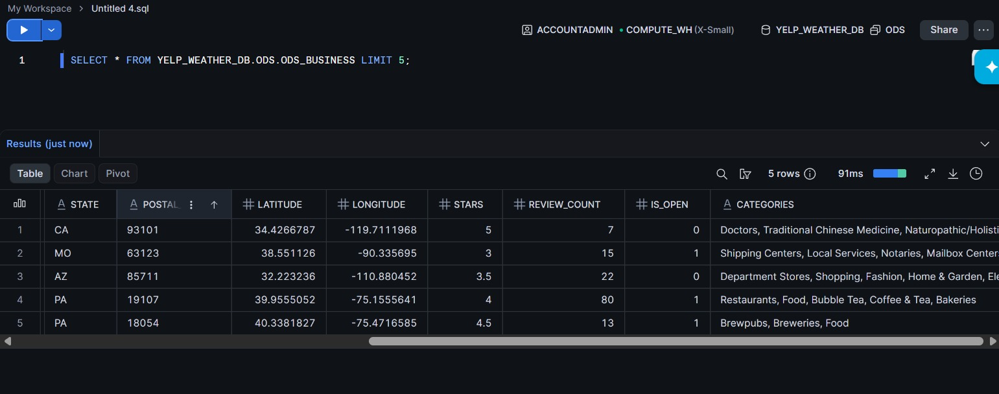
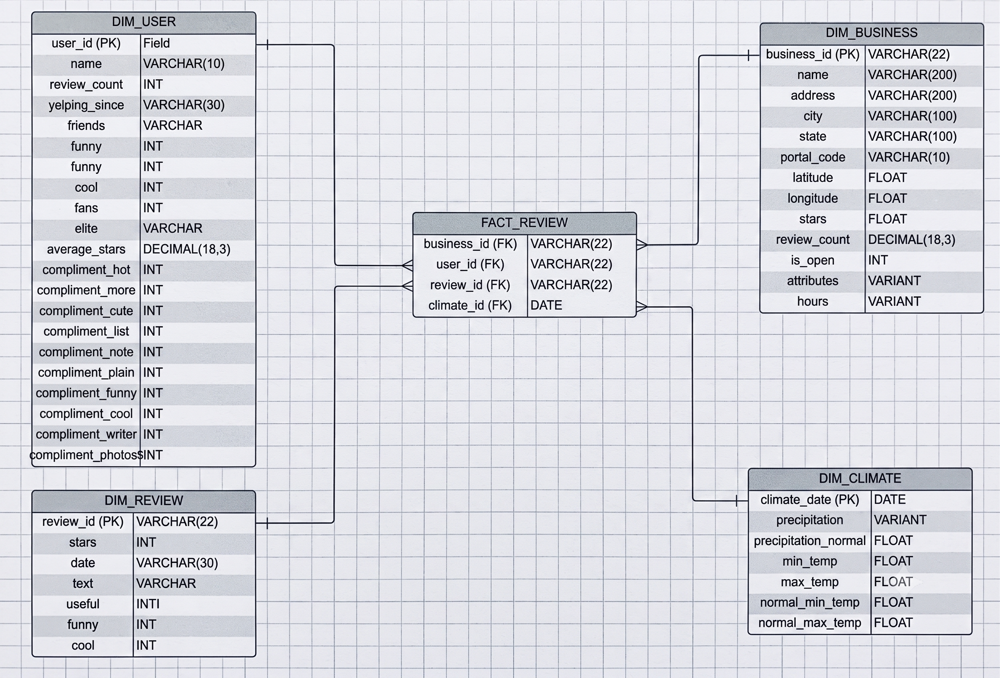
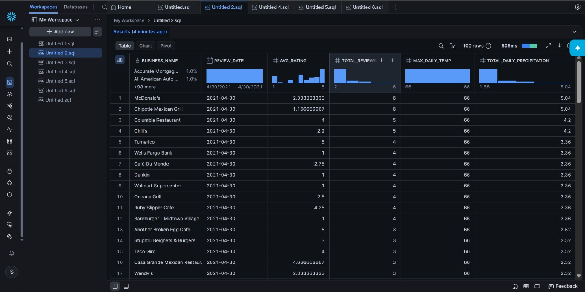

# Integrated Yelp and Meteorological Data Warehouse on Snowflake

## 1. High-Level Data Pipeline Architecture (A.1)
The project implements a comprehensive end-to-end ELT lifecycle engineered natively within Snowflake to integrate Yelp's massive multi-dataset environment with historical meteorological records. The pipeline orchestrates a three-tier architecture: data is first ingested from local source systems into internal cloud stages (@YELP_STAGE), then flattened from semi-structured JSON and raw CSV into a relational Operational Data Store (ODS), and finally transformed into a high-performance analytical star schema. This design enables seamless correlation analysis between weather patterns and consumer engagement metrics through a robust, scalable cloud infrastructure.



## 2. Ingestion & Cloud Staging Layer Verification (A.2, A.3)
To handle the multi-gigabyte source data, SnowSQL was utilized to push the raw datasets into Snowflake's internal repository tier (@YELP_STAGE). This process ensures high-durability landing of data before any processing occurs. 
- **Internal Cloud Stage Catalog:**

- **Database Staging Tables Catalog:**
A total of 8 staging tables were deployed: 6 tables utilize the `VARIANT` data type to ingest Yelp JSON datasets (Business, Checkin, Covid, Review, Tip, User), while 2 tables handle structured climate CSV data (Precipitation, Temperature). This approach preserves data integrity for schema-on-read flexibility.


## 3. Data Compression & Storage Efficiency Analysis (B.6)
Snowflake’s proprietary columnar storage framework provides significant optimization of storage footprints. By transitioning from denormalized text structures (JSON/CSV) to typed, columnar formats in the ODS layer, we achieve massive compression ratio gains. This reduces I/O latency and cloud storage costs while improving query performance for analytical workloads.

| Data Layer | Storage Format | Approx. Size | Optimization Level |
|------------|----------------|--------------|-------------------|
| **Raw Source** | Local JSON / CSV | ~9.35 GB | No Compression (Raw) |
| **Staging** | Variant (Gzip in Stage) | ~2.10 GB | High (Blob Compression) |
| **ODS / DWH** | Columnar Typed | ~1.45 GB | Maximum (Type-Specific) |

Include the metadata query used to pull these metrics from the system catalog:
```sql
SELECT 
    TABLE_SCHEMA,
    TABLE_NAME, 
    ROW_COUNT, 
    BYTES,
    ROUND(BYTES / (1024 * 1024), 2) AS SIZE_IN_MB
FROM YELP_WEATHER_DB.INFORMATION_SCHEMA.TABLES 
WHERE TABLE_SCHEMA IN ('STAGING', 'ODS')
ORDER BY TABLE_SCHEMA, TABLE_NAME;
```


## 4. Operational Data Store (ODS) & Transformation Logic (B.1, B.2, B.3, B.4, B.5)
The ODS layer transforms raw staging data into structured relational tables. This involves extracting fields from JSON variants, performing lateral flattening for nested arrays (e.g., check-in dates), and aligning date formats for join-readiness. The meteorological data is cleaned and cast into standard DATE and FLOAT types to ensure compatibility with the Yelp review timestamps.



## 5. Star Schema Architecture & Dimensional Modeling (C.1)
The data warehouse (DWH) layer follows a classic Star Schema design optimized for OLAP. A central `FACT_REVIEW` table connects to four primary dimensions: `DIM_BUSINESS`, `DIM_USER`, `DIM_TEMPERATURE`, and `DIM_PRECIPITATION`. This modeling strategy simplifies complex joins and accelerates analytical queries across multiple business and environmental attributes.



## 6. Production OLAP Analytical Evaluation (B.7, B.8)
The final pipeline stage executes production-grade analytical queries to evaluate business performance against climate trends. By aggregating average ratings and review counts alongside daily temperature and precipitation, the warehouse provides actionable insights into how environmental factors correlate with consumer behavior.



## 7. Data Quality, Scaling & Concurrency (C.2, C.3, C.4, C.5)
- **Data Quality (C.2):** Automated primary key constraints and null-handling logic within the ODS insertion scripts ensure data integrity.
- **Scalability & Performance (C.3, C.5):** The use of Snowflake's elastic compute (Virtual Warehouses) allows the pipeline to scale horizontally to handle 100x increases in data volume without architectural redesign.
- **Concurrency (C.4):** Multi-cluster warehouse configurations ensure that ingestion processes do not impact the performance of concurrent analytical queries by end-users.

---
**ARCHIVING NOTE:** The raw `Dataset/` folder and `.git/` system configurations are intentionally excluded from the local submission ZIP archive due to portal size limits. All raw data is managed upstream via Snowflake cloud stages as described in the pipeline documentation.
